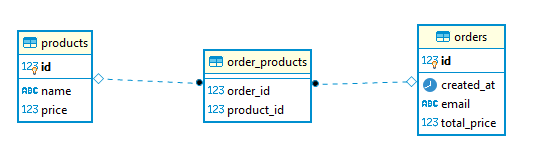
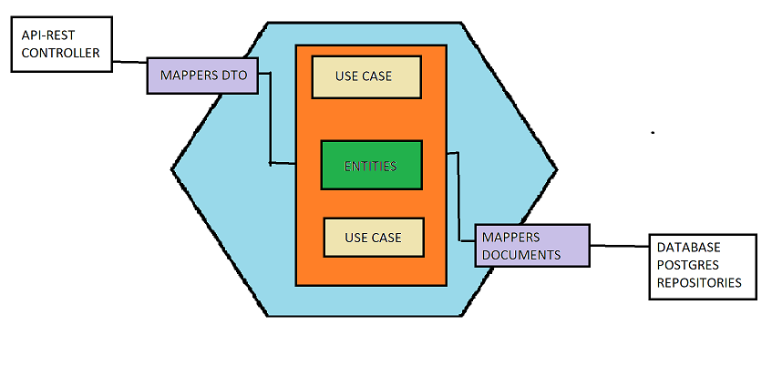

#PRODUCT-ORDER WEB SERVICE
###Description
This little project consists of a REST/JSON web service that supports some CRUD operations for creating products and placing orders.

For this purpose I followed a hexagonal architecture where all the operations go around the domain classes (Entities).
###Get started
- Install docker desktop and run it
- Open a terminal in the root folder of the project and run the following commands:
    - `docker build -t my-postgres-db ./` (Creates the image of the db using the Dockerfile)
    - `docker run -d --name my-postgresdb-container -p 5432:5432 my-postgres-db` (runs the DB)
###Technology
- Java 11
- Spring boot
- Postgresql
- Junit 6
- Assertj
- Mockito
###Api-Rest Contract
You can access to a postman documentation with all the operation supported and some examples in the following link:
[Postman Documentation link](https://www.google.com)
###CONSIDERATIONS TO IMPROVE
- Implement custom exceptions and an exception handler, indicating when a product hasn't been found or some validation in the data.
- Add security:
     - HTTPS protocol using a SSL certificate.
     - Implementing Oauth2 authorization to identify clients via token.
     - Create spring vault to store sensible data (URLs, ports, passwords)
- To make this service redundant we would need to deploy some instances of the project in AWS ECS and then configure the Elastic Load Balancer. Depends on the amount of requests we are expecting we would instanciate more or less containers. This way we would provide a high availability service to the clients. 

###Database schema

###Architecture and Design
